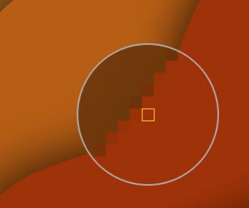

# MPicker

MPicker是参考[deepin-picker](https://github.com/linuxdeepin/deepin-picker)的设计和实现在Windows下重写的版本。该工具仅提供简单的屏幕颜色拾取功能。

具体原理和设计理念请看原深度CTO王勇的文章：[Linux实时放大镜原理](https://www.jianshu.com/p/e0023be705f7)。

## 效果图

## 功能列表：

> ✅代表已经实现，🔧代表正在开发。

|功能|是否完成|
|---|-------|
|多屏拾色|✅|
|拾色器放大镜，支持精确像素级别拾色|✅|
|多种颜色读取格式，便于在不同场景下使用|✅|
|点击托盘图标快速拾色|✅|
|可配置开机自启动|✅|
|滚轮缩放拾色器|✅|
|可配置快速拾色快捷键|🔧|
|支持国际化翻译|🔧|
